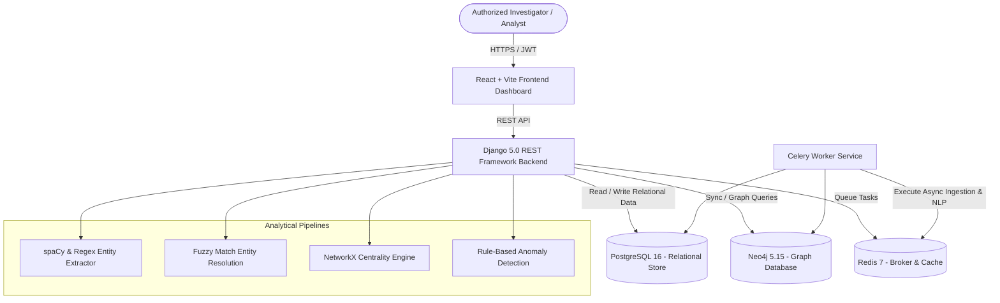

# AI-Powered Criminal Network Analysis System — Architecture & System Design Document

## 1. Executive Summary & Core Objective

The **AI-Powered Criminal Network Analysis System** (NEXUS INTEL) is a containerized, law-enforcement enterprise platform designed to process structured and unstructured crime and intelligence data. It resolves entity identities, maps multi-hop network topologies across relational and graph databases, runs topological centrality metrics, and triggers rule-based anomaly detection for high-risk pattern discovery.

---

## 2. High-Level System Architecture

---

## 3. Technology Stack & Component Rationale

| Layer | Technology | Primary Rationale |
| :--- | :--- | :--- |
| **Backend Framework** | Python 3.12 / Django 5.0 / DRF | Enterprise stability, ORM indexing, Django admin, built-in security controls. |
| **Relational Database** | PostgreSQL 16 | ACID compliance, JSONB document fields, structured indexing, audit tracking. |
| **Graph Database** | Neo4j 5.15 (Cypher) | Native graph engine for multi-hop Cypher queries, shortest-path calculation, sub-graph extraction. |
| **Graph Analytics** | NetworkX | Centrality algorithms (Degree, Betweenness, PageRank) and Louvain modularity clustering. |
| **NLP Pipeline** | spaCy (`en_core_web_sm`) + Regex | Entity recognition (PERSON, ORG, LOC) and structured pattern extraction (PHONE, EMAIL, ACCOUNT). |
| **Task Queue** | Redis 7 + Celery 5.3 | Asynchronous document processing, heavy graph sync tasks, periodic anomaly scans. |
| **Frontend Framework** | React 18 / Vite / TypeScript | Fast rendering, strong type-safety, modular component architecture. |
| **Graph Visualization** | Cytoscape.js | High-performance canvas layout engine (`cose`), node styling, interactive event listeners. |
| **Styling** | Tailwind CSS (Dark Mode) | High-contrast law enforcement dark UI palette, glassmorphism, responsive grid layout. |

---

## 4. Dual Database Architecture & Synchronization

The system employs a **dual-database pattern**:
1. **PostgreSQL** acts as the primary relational system of record for entities, relationships, raw documents, audit logs, and user credentials.
2. **Neo4j** acts as the analytical graph database used for topological exploration and Cypher queries.

### Synchronization Strategy
When entities or relationships are created or merged in PostgreSQL, a graph sync worker invokes `sync_investigation_to_neo4j()`:
* Nodes in Neo4j are stored as `(:Entity {id, name, entity_type, confidence})`.
* Edges in Neo4j are stored as `(:Entity)-[:RELATIONSHIP_TYPE {id, confidence, evidence}]->(:Entity)`.

---

## 5. Security Architecture & RBAC Matrix

The system enforces granular Role-Based Access Control (RBAC) via custom permissions (`IsAdminUser`, `IsInvestigator`, `IsAnalyst`, `IsViewer`).

| Role | Case Creation | Entity Merging | Document Ingestion | Run Pipeline | Audit Log Access | User Management |
| :--- | :---: | :---: | :---: | :---: | :---: | :---: |
| **ADMIN** | ✅ | ✅ | ✅ | ✅ | ✅ | ✅ |
| **INVESTIGATOR** | ✅ | ✅ | ✅ | ✅ | ❌ | ❌ |
| **ANALYST** | ❌ | ❌ | ✅ | ✅ | ❌ | ❌ |
| **VIEWER** | ❌ | ❌ | ❌ | ❌ | ❌ | ❌ |

---

## 6. Anomaly Detection Algorithms

1. **Circular Money Flow**: Identifies directed transaction loops ($A \rightarrow B \rightarrow C \rightarrow A$) executed within short time windows to detect money laundering.
2. **High Communication Frequency**: Detects pairs with $>5$ call/message events within a 24-hour window.
3. **Dispatcher / High Centrality Node**: Identifies nodes contacting $>15$ distinct targets within 24 hours.
4. **Rapid Multi-Location Movement**: Identifies entities logged at location events $>50$km apart in under 2 hours.
5. **Shared Identifier Collision**: Detects separate entities associated with identical phone numbers or bank accounts.
